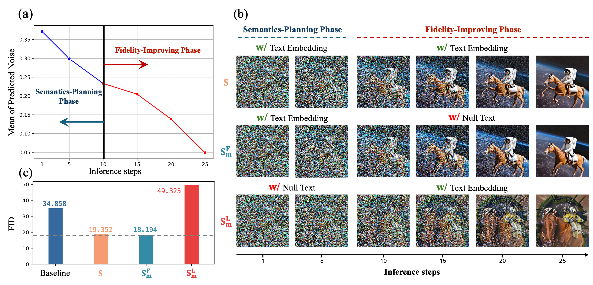

<div align="center">
<h1>T-GATE: Cross-Attention Makes Inference Cumbersome in Text-to-Image Diffusion Models 🥳</h1>  

[Wentian Zhang](https://wentianzhang-ml.github.io/)<sup>&#42;</sup>&nbsp; [Haozhe Liu](https://haozheliu-st.github.io/)<sup>1&#42;</sup>&nbsp; [Jinheng Xie](https://sierkinhane.github.io/)<sup>2&#42;</sup>&nbsp; [Francesco Faccio](https://scholar.google.com/citations?user=0z3DkrkAAAAJ&hl=en)<sup>3</sup>&nbsp; 

[Mike Zheng Shou](https://scholar.google.com/citations?hl=zh-CN&user=h1-3lSoAAAAJ&view_op=list_works&sortby=pubdate)<sup>2</sup>&nbsp; [Jürgen Schmidhuber](https://scholar.google.com/citations?user=gLnCTgIAAAAJ&hl=en)<sup>1,3</sup>&nbsp; 

<sup>1</sup> AI Initiative, King Abdullah University of Science And Technology &nbsp; 

<sup>2</sup> Show Lab, National University of Singapore &nbsp; <sup>3</sup> The Swiss AI Lab, IDSIA

[](https://arxiv.org/abs/2404.02747)
</div>


## Quick Introduction

> We find that cross-attention outputs converge to a fixed point during the initial denoising steps. Consequently, the entire inference process can be divided into two stages: an initial semantics-planning phase, during which the model relies on text to plan visual semantics, and a subsequent fidelity-improving phase, during which the model tries to generate images from previously planned semantics. Surprisingly, ignoring text conditions in the fidelity-improving stage not only reduces computation complexity, but also slightly decreases FID score. This yields a simple and training-free method called TGATE for efficient generation, which caches the cross-attention output once it converges and keeps it fixed during the remaining inference steps. 


>  The images generated by the diffusion model with or without TGATE. Our method can accelerate the diffusion model without generation performance drops. It is training-free and can be widely complementary to the existing studies.


## 🚀 Major Features 

* Training-Free.
* Easily Integrate into Existing Frameworks.
* Only a few lines of code are required.
* Friendly support CNN-based U-Net, Transformer, and Consistency Model
* 10%-50% speed up for different diffusion models. 

  
## 📄 Updates


* 2024/04/04: Technical Report is available on [arxiv](https://arxiv.org/abs/2404.02747). 

* 2024/04/04: TGATE for DeepCache (SD-XL) is released.

* 2024/03/30: TGATE for SD-1.5/2.1/XL is released.

* 2024/03/29: TGATE for LCM (SD-XL), PixArt-Alpha is released.
  
* 2024/03/28: TGATE is open source.


## 📖 Key Observation



>  The images generated by the diffusion model at different denoising steps. The first row feeds the text embedding to the cross-attention modules for all steps. The second row only uses the text embedding from the first step to the 10th step, and the third row inputs the text embedding from the 11th to the 25th step.

We summarize our observations as follows:

* Cross-attention converges early during the inference process, which can be characterized by a semantics-planning and a fidelity-improving stages. The impact of cross-attention is not uniform in these two stages.

* The semantics-planning embeds text through cross-attention to obtain visual semantics.

* The fidelity-improving stage improves the generation quality without the requirement of cross-attention. In fact, a null text embedding in this stage can improve performance.

## 🖊️ Method

* Step 1: TGATE caches the attention outcomes from the semantics-planning stage.
```
if gate_step == cur_step:
    hidden_uncond, hidden_pred_text = hidden_states.chunk(2)
    cache = (hidden_uncond + hidden_pred_text ) / 2
```

* Step 2: TGATE reuses them throughout the fidelity-improving stage.

```
if cross_attn and (gate_step<cur_step):
    hidden_states = cache
```

## 📄 Results
| Model                 | MACs     | Param     | Latency | Zero-shot 10K-FID on MS-COCO |
|-----------------------|----------|-----------|---------|---------------------------|
| SD-1.5                | 16.938T  | 859.520M  | 7.032s  | 23.927                    |
| SD-1.5 w/ TGATE       | 9.875T   | 815.557M  | 4.313s  | 20.789                    |
| SD-2.1                | 38.041T  | 865.785M  | 16.121s | 22.609                    |
| SD-2.1 w/ TGATE       | 22.208T  | 815.433 M | 9.878s  | 19.940                    |
| SD-XL                 | 149.438T | 2.570B    | 53.187s | 24.628                    |
| SD-XL w/ TGATE        | 84.438T  | 2.024B    | 27.932s | 22.738                    |
| Pixart-Alpha          | 107.031T | 611.350M  | 61.502s | 38.669                    |
| Pixart-Alpha w/ TGATE | 65.318T  | 462.585M  | 37.867s | 35.825                    |
| DeepCache (SD-XL)     | 57.888T  | -         | 19.931s | 23.755                    |
| DeepCache w/ TGATE    | 43.868T  | -         | 14.666s | 23.999                    |
| LCM (SD-XL)           | 11.955T  | 2.570B    | 3.805s  | 25.044                    |
| LCM w/ TGATE          | 11.171T  | 2.024B    | 3.533s  | 25.028                    |
| LCM (Pixart-Alpha)    | 8.563T   | 611.350M  | 4.733s  | 36.086                    |
| LCM w/ TGATE          | 7.623T   | 462.585M  | 4.543s  | 37.048                    |

The latency is tested on a 1080ti commercial card. 

The MACs and Params is calculated by [calflops](https://github.com/MrYxJ/calculate-flops.pytorch). 

The FID is calculated by [PytorchFID](https://github.com/mseitzer/pytorch-fid).

## 🛠️ Requirements 

* diffusers==0.27.0.dev0
* pytorch==2.2.0
* transformers


## 🌟 Usage

To use TGATE for accelerating the denoising process, you can simply use `main.py`. For example,
```
python main.py \
--prompt 'your prompt (str)' \
--model ['pixart','sd_xl','sd_2.1','sd_1.5','lcm_sdxl','lcm_pixart'] \
--gate_step 10 \ 
--saved_path 'file/to/save' \
--inference_step 25
```
For LCMs, `gate_step` is set as 1 or 2, and `inference step` is set as 4.
After running, a generated image will be collected at 'file/to/save/test.png'.

### Examples

For easy utilization, each sub folder can run independently. 

SD-1.5 w/ TGATE: generate an image with the caption: "A coral reef bustling with diverse marine life." 

```
cd SD_1_5
python generate.py
```


SD-2.1 w/ TGATE: generate an image with the caption: "High quality photo of an astronaut riding a horse in space" 

```
cd SD_2_1
python generate.py
```


SD-XL w/ TGATE: generate an image with the caption: "Astronaut in a jungle, cold color palette, muted colors, detailed, 8k" 

```
cd SDXL
python generate.py
```

Pixart-Alpha w/ TGATE: generate an image with the caption: "An alpaca made of colorful building blocks, cyberpunk." 

```
cd PixArt_alpha
python generate.py
```

LCM w/ TGATE: generate an image with the caption: "Self-portrait oil painting, a beautiful cyborg with golden hair, 8k" 

```
cd LCM
python generate.py
```

DeepCache w/ TGATE: generate an image with the caption: "A haunted Victorian mansion under a full moon." 

```
cd DeepCache
python generate.py
```


##  📖 Related works: 

We encourage the users to read [DeepCache](https://arxiv.org/pdf/2312.00858.pdf) and [Adaptive Guidance](https://arxiv.org/pdf/2312.12487.pdf)

| Methods           | U-Net   | Transformer | Consistency Model |
|-------------------|---------|-------------|-------------------|
| DeepCache         | &check; | &cross;     | -                 |
| Adaptive Guidance | &check; | &check;     | &cross;           |
| TGATE (Ours)      | &check; | &check;     | &check;           |


Compared with DeepCache: 
* TGATE can cache one time and re-use the cached feature until ending sampling. 
* TGATE is more friendly for Transformer-based Architecture and mobile devices since it drops the high-resolution cross-attention.
* TGATE is complementary to DeepCache. 

Compared with Adaptive Guidance: 
* TGATE can reduce the parameters in the second stage. 
* TGATE can further improve the inference efficiency.
* TGATE is complementary to non-cfg framework, e.g. latent consistency model. 
* TGATE is open source.

## Acknowledgment 

* We thank [prompt to prompt](https://github.com/google/prompt-to-prompt)  and [diffusers](https://huggingface.co/docs/diffusers/index) for the great code.

## Citation
If you find our work inspiring or use our codebase in your research, please consider giving a star ⭐ and a citation.
```
@article{tgate,
  title={Cross-Attention Makes Inference Cumbersome in Text-to-Image Diffusion Models},
  author={Zhang, Wentian and Liu, Haozhe and Xie, Jinheng and Faccio, Francesco and Shou, Mike Zheng and Schmidhuber, J{\"u}rgen},
  journal={arXiv preprint arXiv:2404.02747},
  year={2024}
}
```
